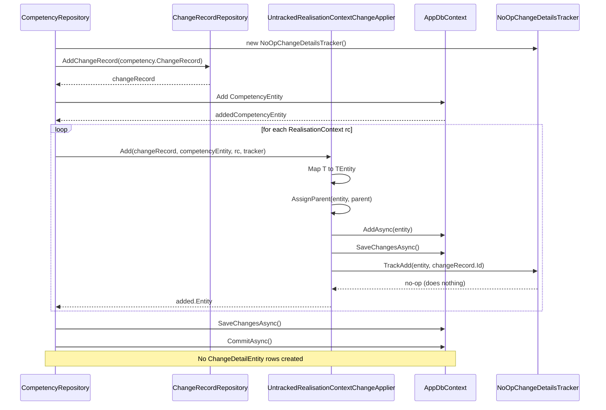
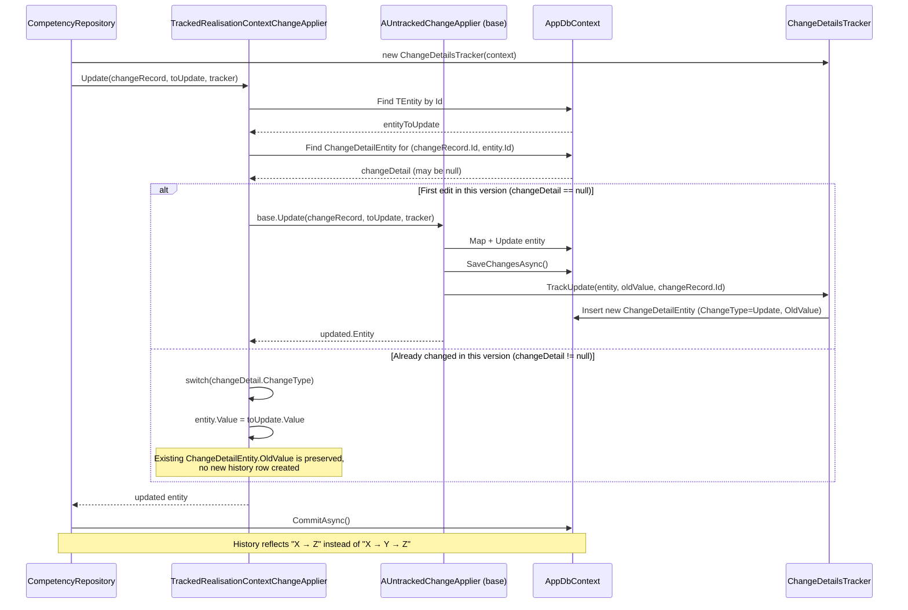

# ChangeTracker — Versioned Change Application

This folder implements the logic that applies changes (Add / Update / Delete) to
`Changeable` domain entities (e.g. `RealisationContext`, `MinisterialCompetencyElement`,
`PerformanceCriteria`, course framework changeables), while optionally recording
those changes against a specific **version** (`ChangeRecord`).

There are two independent axes to understand:

1. **`IChangeApplier<T, TParent, TEntity>`** — *how* a change is applied to the database
   (plain save vs. version-history-aware save).
2. **`IChangeTracker`** — *whether* the change is logged as a `ChangeDetailEntity` for
   history/audit purposes, or simply ignored.

They are combined at the repository level to produce four possible behaviors.

---

## 1. `IChangeApplier<T, TParent, TEntity>`

### `AUntrackedChangeApplier<T, TParent, TEntity>` (base class)
- Applies changes **directly** to `AppDbContext` (map → add/update/remove → `SaveChangesAsync`).
- Delegates the audit logging decision entirely to the `IChangeTracker` passed in.
- Has no notion of "was this entity already changed within the current version?".

### `ATrackedChangeApplier<T, TParent, TEntity>` (inherits `AUntrackedChangeApplier`)
- Adds **version-collapsing logic** on top of the base behavior:
  - **Update**: checks if a `ChangeDetailEntity` already exists for this entity *within the
    current `ChangeRecord`*. If none exists, falls back to the untracked behavior (first
    change of the version). If one exists, it mutates the entity in place based on the
    existing `ChangeType` (`Add`/`Update`), so editing the same field twice in one version
    doesn't create duplicate history rows.
  - **Delete**: reconciles deletions against changes already recorded in the same version
    (e.g. an entity added *and* deleted in the same version is fully removed instead of
    leaving an "add" + "delete" history trail).

